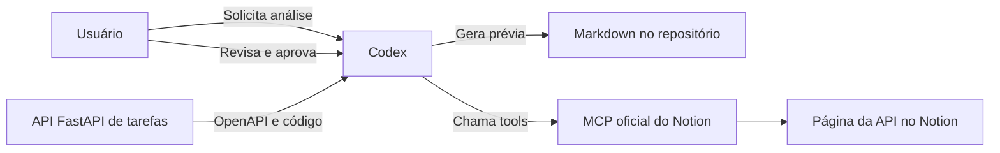

# Definição do MVP — Documentação de API FastAPI no Notion

## 1. Objetivo

Este projeto é um laboratório prático para estudar o Model Context Protocol
(MCP) por meio da documentação de uma API.

O MVP deverá permitir que uma API simples, desenvolvida com FastAPI, seja
analisada pelo Codex. A partir dessa análise, o Codex produzirá uma
documentação técnica revisável e, após autorização do usuário, publicará o
conteúdo no Notion utilizando o MCP oficial.

O processo acontecerá sob demanda: não haverá monitoramento automático do
código, execução em pipeline ou publicação a cada alteração.

## 2. Componentes e responsabilidades

### API FastAPI

Será o projeto analisado e documentado. Ela deverá expor uma especificação
OpenAPI válida e possuir código, modelos e testes suficientemente claros para
que seu comportamento possa ser compreendido.

### Codex

Será o agente responsável por:

- analisar a especificação OpenAPI e o código-fonte autorizado;
- consultar modelos, docstrings e testes quando necessário;
- identificar rotas, contratos, validações e possíveis erros;
- diferenciar informações comprovadas de inferências;
- gerar uma prévia da documentação em Markdown;
- solicitar aprovação antes da publicação;
- utilizar as tools do MCP oficial do Notion para publicar o conteúdo;
- informar falhas, ambiguidades e resultados da publicação.

Não será desenvolvido um agente ou orquestrador próprio para executar esse
fluxo. O processo começa quando o usuário solicita a documentação ao Codex.

### MCP oficial do Notion

Será a integração utilizada pelo Codex para criar ou atualizar a documentação
no Notion, respeitando as permissões concedidas pelo usuário.

O desenvolvimento de um servidor MCP próprio não faz parte deste MVP.

### Notion

Será o destino final da documentação aprovada. Cada API será representada por
uma única página contendo sua visão geral, modelos e endpoints.

## 3. Arquitetura

Não haverá comunicação direta entre a API FastAPI e o Notion. O Codex
coordenará a análise, a geração da documentação e a publicação.

## 4. API de exemplo

O domínio escolhido para a API é o gerenciamento de tarefas.

A aplicação será construída com:

- FastAPI;
- modelos Pydantic;
- SQLite para persistência local;
- documentação OpenAPI gerada pelo FastAPI;
- testes automatizados para os comportamentos principais.

Uma tarefa deverá conter, no mínimo:

- identificador;
- título;
- descrição opcional;
- status;
- data de criação;
- data de atualização.

A API deverá oferecer operações para:

- criar uma tarefa;
- listar tarefas;
- consultar uma tarefa por identificador;
- atualizar uma tarefa;
- excluir uma tarefa.

Os endpoints deverão declarar corretamente parâmetros, corpos de requisição,
modelos de resposta, códigos HTTP, validações e respostas de erro. Exemplos e
descrições deverão ser incluídos quando ajudarem a demonstrar a análise feita
pelo Codex.

## 5. Fontes da análise

A especificação OpenAPI será a fonte principal dos contratos públicos da API.
O Codex também poderá analisar:

- código das rotas;
- modelos Pydantic;
- regras de validação;
- docstrings e comentários relevantes;
- testes automatizados;
- configurações necessárias para compreender a aplicação.

Quando uma conclusão não estiver comprovada por essas fontes, ela deverá ser
marcada como inferência ou pendência de validação.

Credenciais, tokens, arquivos de ambiente e outros dados sensíveis não deverão
ser incluídos na documentação.

## 6. Fluxo de documentação e publicação

1. O usuário solicita ao Codex a documentação da API.
2. O Codex identifica a versão analisada, preferencialmente pelo commit Git.
3. O Codex analisa o OpenAPI, o código e os testes relacionados.
4. O Codex informa ambiguidades que impeçam uma documentação confiável.
5. O Codex gera uma prévia em `docs/api-tarefas.md`.
6. O usuário revisa a prévia e autoriza ou rejeita a publicação.
7. Somente após aprovação explícita, o Codex acessa o MCP oficial do Notion.
8. O Codex procura uma página já existente para a API antes de criar outra.
9. O Codex cria ou atualiza uma única página com a documentação aprovada.
10. O Codex informa o resultado e eventuais falhas ao usuário.

Se a publicação falhar, o Markdown gerado deverá permanecer no repositório
para revisão ou nova tentativa.

Uma atualização não deverá apagar conteúdo manual existente no Notion sem
confirmação do usuário.

## 7. Estrutura esperada da documentação

A prévia em Markdown e a página publicada no Notion deverão conter, quando
aplicável:

1. nome e objetivo da API;
2. versão ou commit analisado;
3. data da análise;
4. visão geral da arquitetura;
5. dependências externas relevantes;
6. modelos de entrada e saída;
7. lista de endpoints;
8. método, caminho e finalidade de cada endpoint;
9. parâmetros de rota, query e cabeçalho;
10. corpo das requisições;
11. códigos de status e possíveis erros;
12. exemplos de requisição e resposta;
13. inferências e informações pendentes de validação.

## 8. Critérios de aceitação

O MVP será considerado concluído quando:

- a API FastAPI de tarefas estiver funcional e utilizar SQLite;
- todas as rotas estiverem representadas corretamente no OpenAPI;
- os comportamentos principais estiverem cobertos por testes;
- o Codex conseguir documentar todas as rotas usando OpenAPI e código;
- a prévia for preservada em `docs/api-tarefas.md`;
- fatos, inferências e pendências forem claramente diferenciados;
- nenhuma credencial ou informação sensível aparecer na documentação;
- a publicação ocorrer somente após aprovação explícita do usuário;
- o Codex utilizar o MCP oficial do Notion para publicar uma página única;
- uma falha no Notion não causar a perda da documentação em Markdown;
- a publicação evitar a criação acidental de páginas duplicadas.

## 9. Fora do escopo

Não fazem parte do MVP:

- desenvolver um servidor MCP próprio;
- desenvolver um agente ou orquestrador separado do Codex;
- criar uma interface web para iniciar a documentação;
- monitorar alterações no código automaticamente;
- publicar a cada commit ou por pipeline de CI/CD;
- suportar outros frameworks ou linguagens;
- documentar vários projetos simultaneamente;
- substituir a documentação OpenAPI nativa do FastAPI;
- implantar a solução em ambiente de produção.

## 10. Decisões consolidadas

- A API de exemplo será uma API de tarefas.
- A persistência será feita com SQLite.
- O Codex realizará a análise quando solicitado pelo usuário.
- A análise utilizará OpenAPI e código-fonte.
- A prévia será um arquivo Markdown versionável no repositório.
- A publicação dependerá de revisão e aprovação humana.
- A documentação da API ficará em uma única página do Notion.
- A integração será feita pelo MCP oficial do Notion.
- Nenhum servidor MCP próprio será criado no MVP.
